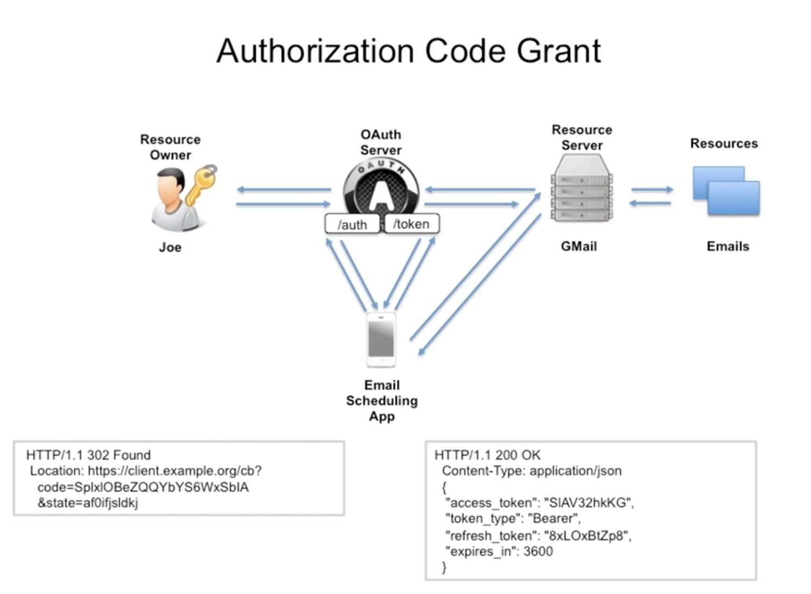

## Notes for Oauth Course

**Oauth Actors** - different parts of the oauth ecosystem that interact to complete the system

### Example Scenario for Oath
* Imagine we have a user (Joe) who has access to some resource (emails). Joe has access to the emails through and resource server (gmail server). The resource server also authenticates Joe by requiring a password. 

* Third Party Access - Imagine we now have some sort of 3rd party email scheduling app aka an app that can send emails on a set schedule and wasn't written by google/gmail.  The App needs access to the emails, but don't want to provide Joe's password to the scheduling app.

* OAuth 2.0 - Lets consider adding another actor, an OAuth Server. The email scheduling app will no longer need to directly contact the resource server; first it contacts the OAuth server. OAuth server then sends login screen to resource owner (Joe). Joe enters password and OAuth server verifies,  Then sends token to email scheduling app. Email scheduling app now sends request to resource server along with token, and resource server takes that token and reaches out to the OAuth server with token to verify if it is legitimate for the action requested.  If all good, sends ok back to resource server, resource server gets email from its DB and sends it out to email scheduling app

### OAuth Components
**Actors**
* OAuth Provider - consists of 3 components.
  + Authentication component - provides login and identity provider
  + Consent server - requests the authenticated users consent
  + Token Management infrastructure (DB)
* Resource Provider - Makes a protected resource available via http
* Resource Owner - Whoever the authenticated user is. Delegates access rights to 3rd party client
* Client - the party a token is provisioned to. Identified via ClientID and ClientSecret

**OAuth Server Endpoints**
* /authorize GET - Authorization code for auth code grant or access token for implicit grant
* /token POST - Produces access token and refresh token
* /verify - not accessible from outside the resource server

**Endpoints writ large**
* Authorization endpoint (/authorize GET)
  + Paramaters: state, scope, response_type(auth_code or token-implcit), client_id, redirect_uri(result of auth call payload sent to, usually on client)
* Token endpoint(/token POST with auth clientid:clientSecret)
  + Parameters: grant_type, code, client_id, redirect_uri
  + Output: Access Token and Refresh Token (for Auth code grant, client credentials grant and recource owner password credentials grant)
* Redirect endpoint - GET for client
  + Parameters: state, scope, code 
* Resource endpoint

**Tokens and Credentials**
* Access Tokens 
* Refresh Tokens - never sent to the resource server
* Authorization code - Oauth provider creates and sends to client. Usually valid for a few minutes and used to request access code

### OAuth Flows
* Example
  + Email scheduling app contacts OAuth server with type of recources it needs access to (ex. emails), and some meta info (state)
  + OAuth server (API) then prompts resource owner to make request on the auth endpoint. This isn't usually handled directly by the OAuth server, rather it redirects initial request to some sort of login service which provides login UI to resource owner
  + Resource owner then authenticates (usually via username/password) which makes it back to OAuth server (usually throgh login service). If successful Oauth server then generates an authorization code (random numbers/letters usually), which is sent back to the email scheduling app
  + Email app then sends request for resource to resource server with the auth code in the header
  + Resource server then sends auth code to OAuth server alond with details about what resource is being requested. OAuth server confirms that auth code is applicable for requested resources and if so sends back ok to Resource server.
  + Resource server then gets the email from its DB and sends back to scheduling app

* Overview of flows
  + For each OAuth flow there is an OAuth grant type
  + **Authorization Code Flow (Authorization Code Grant)** - also known as 3 legged OAuth. Default flow and most secure. Prerequisite is client has ability to store client id and secret. Other flows are simplifications of this flow
  + **Implicit Flow (Implicit Grant Type)** - used when client cannot securly store tokens, ids or secrets; generaly the case when the client is purley client side javascript. Drawback is not very convienient because you can't easily refresh an access token. 
  + **Client Credentials Flow (Client Credentials Grant)** - Also known as 2 legged OAuth. Applied when client is also resource owner
  + **Resource Owner Password Credentials Flow (Resource Owner Password Credentials Grant)** - used when resource owner can entrust password to the client.

#### Authorization Code Flow

* OAuth server authenticates user via username and password. Oauth server authenticates client by client id and client secret. Client authenticates Oauth server by certificate and URL.
* This flow is used when the client can store id, secret, tokens (aka a server side web app)
##### Authorization Endpoint
1. Get the Authorization Code - client requests authorization code from oauth server /auth endpoint 
    1. Kicked off by some sort of request from Resource Owner to client
    2. Client reaches out to /auth endpoint of OAuth server to get code
        1. Also will include type of access requested from code (scopes)
        2. Kind of response requested
        3. Client_id
        4. Redirect URI - Where Oauth server sends results back to (has to match up to client_id)
        5. State - used to map responses on client side
    3. OAuth server redirects or sends login page to resource owner
    4. Resource owner sends login info back to OAuth server
    5. OAuth server sends request back to resource owner with details about the type of information/access requested
    6. Resource owner agrees, sends constent back to OAuth server
    7. Oauth server sends http redirect to client
        1. Techinically it sends redirect to browser of resource owner which redirects to the clinet
        2. includes state from original client request
    8. Grant is now created, but note that no token is generated, so the client still will be unable to contact the resource server
2. Get the token - client uses auth code from step one to reach out to /token endpoint to get token
    1. Client reaches out to Oauth server (POST) with:
        1. grant type(authorization code)
        2. auth_code (recieved from auth endpoint in previous step)
        3. client credentials (client_id and client_secret base64 encoded)
    2. Once this is all verified, OAuth server sends back to client JSON containing:
        1. Access Token
        2. Token type (bearer)
        3. Refresh Token
        4. Expires in (access token NOT refresh token)
3. Use Token to access a resource - /resource endpoint on resource server
    1. Client reaches out to resource server for resource with access token from last step
    2. Resource server sends token to OAuth server which verifies token is still valid and valid for the resources requested by the client
    3. If it is OAuth server sends ok back to resource server, which now returns resource to client
---
**Refresh Token Flow** - used when access token is expired but refresh token is not    
1. Client reaches out to /token endpoint via a POST request with:
    1. grant_type (refresh token)
    2. refresh_token
    3. client credentials (client_id and client_secret base64 encoded)
2. /token endpoint responds with a new access_token and a refresh_token
3. Step 3 from the preceeding flow can now be followed for the client to access resources once again    
* Key actors: Resource Owner, Resource Server, Client (mobile or cloud), OAuth server
---
**Implicit Grant Flow**
* Simplification of the auth code flow. Doesn't utilize the token endpoint
* You receieve an access token directly from the /auth endpoint
* Short validity time of access token and reduced security are the drawbacks of this flow
---

