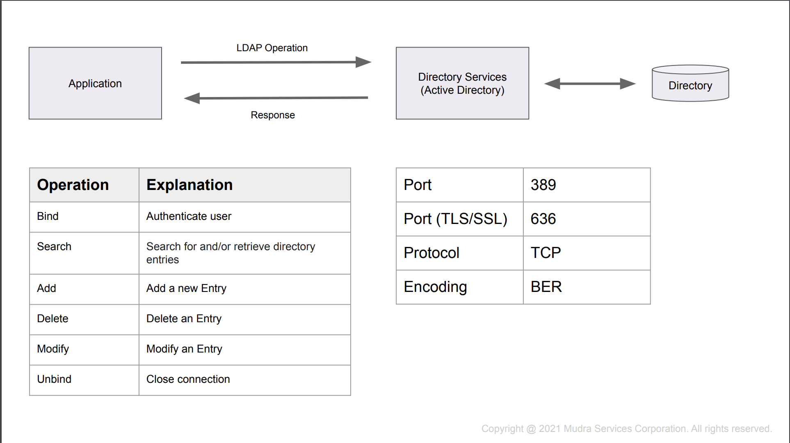
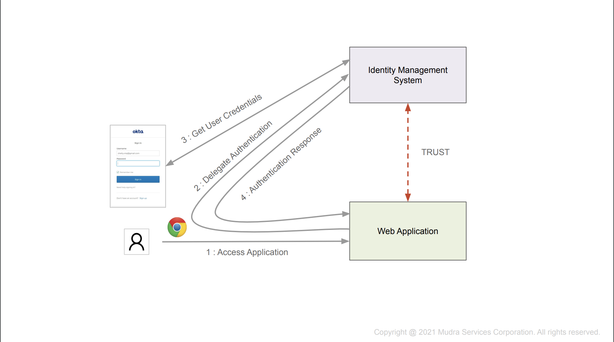
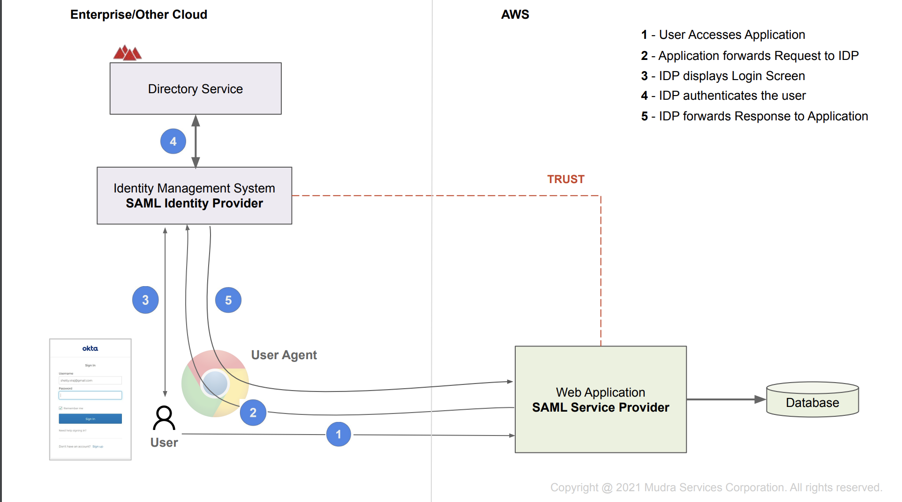

## Notes from SAML Course

### Key Terms
* Authentication (AuthN) - User who logs into the system is a legitimate user
* Authorization (AuthZ) - What the user is allowed to do once logged onto platform/application
* Identity Provisioning - creation of user and role data in the application database
* Directory Services - Entities (User, Group) stored in a tree structure
* Lightweight Directory Access Protocol (LDAP) - Protocol to access Directory services; vendor neutral and all major languages have an implementation

---
### Introduction

* In diagrams...
    * Green Rectangle represents application process
    * Purple Rectangle represents identity process
    * Arrow represents request going from one process to another
    * Curved arrow represents the forwarding of a request
    * User Represented by user cartoon
    * User agent represented by Google chrome logo
---
### Authentication Architectures
**Custom Security Architecture**
* User identity information stored in the application database
* Role (authorization) information also stored in the database
* Once user is logged in HTTP session is established on the server side and Session cookie is established on the browser side
* Problems
    * Doesn't work well in an enterprise where multiple applications are usually required to interact with
    * Provisioning/Deprovisioning complex
* Common Identity
    * Move user identity outside of application databases
    * Identity service will need to provide an API for all the different services to authenticate users
    * This user data store can be known as a Directory Service, with Active Directory being the most common

**LDAP**

* Application can use a LDAP library to connect to a directory service (like active directory) then use a LDAP operation from said library to perform some sore of request on the directory. This is NOT a REST API, its a TCP connection to the directory service.
* DN is the fully qualified name for an entity. It shows the path from the root to the leaf. EX: DN - cn=bob,ou=users,dc=mycompany,dc=com
* User sends username and password to application, user forwards that info onto directory service (Active Directory), if valid a session cookie is establiched on the browser side
* Problems
    * App is sending user login info to directory service. Gets data via POST request from client browser. Web application has direct access to client credentials, which it doesn't use - this is effectivly violating the principle of least privlege: the application should not have access to the credentials because it has no use for them. 
    * User has to enter their password every single time they access the application - IE they need to log into every application (no SSO)
    * For cloud application: Application deployed on AWS cloud may have issues opening a TCP connection to Active Directory on enterprise network
* LDAP Documentation: https://ldap.com/
* Delegated Authentication - to establish session application will redirect request to a seperate trusted component (Identity management system) which will ask for credentieals (rather than managing authentication on its own). 



---
### SAML 2.0 SSO Flows
**Security Assertion Markup Language (SAML) 2.0**
* Was created when XML was popular, so looks very similiar to xml
* In SAML you will commonly see the user refered to as the subject
* Web application (SAML Service Provider) < ---- trust ---- > Identity Management System (SAML Identity Provider)
* SAML Metadata file describes the SAML Entity (SP or IDP) -  Many application servers will automatically generate this file file but the file can also be handcrafted
* Flow(SP initialted SAML SSO):
    * User access app for first time
    * app forwards request to Identity Management system
    * IDP sends login screen to user; user enters credentials
    * IDP comunicates with Directory Service to authenticate user
    * If successful, IDP will send response XML back to the Web app (SAML Service provider) with the *Assertion*, which contains user and their associated groups (user attributes) 


* The SP and IDP in SAML are entities, and have an Entity ID associated with them. You will commonly see this entity ID in requests/responses
* The SP is also frequently called the 'Reliant Party'
* Relay state - After recieving the final response from the IDP and verifying, the SP (Application) can redirect the user to the relay state URL
    * in the event the relay state does not exist the application can redirect to the homepage
* Assertion Consumer Service (ACS) URL - Exposed by the application to consumer the SAML Assertion  (== SSO URL) 

**IDP Initiated SAML SSO** - the version used by thoughtworks login! (with the chicklets)
* User logs into IDP dashboard via URL (IDP SSO URL)
* IDP verifies username and password with directory service
* If successful IDP displays dashboard to user (via redirect to user agent)
* When user clicks on app link from dashboard, this goes to the IDP which creates a rights assertion which contains the user attributes aswell as the group attributes
    * attributes also known as claims in SAML lingo
* Assertion is then sent to the SP, and SP verifies
* SP redirects user to homepage

* SAML Documentation: https://developer.okta.com/docs/concepts/saml/

---
### Example Assertion
```xml
<?xml version="1.0" encoding="UTF-8"?>
<saml2:Assertion ID="id208925862424124341042280053" IssueInstant="2023-04-21T19:01:01.756Z" Version="2.0"
    xmlns:saml2="urn:oasis:names:tc:SAML:2.0:assertion">
    <saml2:Issuer Format="urn:oasis:names:tc:SAML:2.0:nameid-format:entity"/>
    <saml2:Subject>
        <saml2:NameID Format="urn:oasis:names:tc:SAML:1.1:nameid-format:unspecified">userName</saml2:NameID>
        <saml2:SubjectConfirmation Method="urn:oasis:names:tc:SAML:2.0:cm:bearer">
            <saml2:SubjectConfirmationData NotOnOrAfter="2023-04-21T19:06:02.049Z" Recipient="http://localhost:8080/cgi-bin/saml-consumer.py"/>
        </saml2:SubjectConfirmation>
    </saml2:Subject>
    <saml2:Conditions NotBefore="2023-04-21T18:56:02.049Z" NotOnOrAfter="2023-04-21T19:06:02.049Z">
        <saml2:AudienceRestriction>
            <saml2:Audience>http://localhost:8080/saml-app-project-1</saml2:Audience>
        </saml2:AudienceRestriction>
    </saml2:Conditions>
    <saml2:AuthnStatement AuthnInstant="2023-04-21T19:01:01.756Z">
        <saml2:AuthnContext>
            <saml2:AuthnContextClassRef>urn:oasis:names:tc:SAML:2.0:ac:classes:PasswordProtectedTransport</saml2:AuthnContextClassRef>
        </saml2:AuthnContext>
    </saml2:AuthnStatement>
    <saml2:AttributeStatement>
        <saml2:Attribute Name="first" NameFormat="urn:oasis:names:tc:SAML:2.0:attrname-format:unspecified">
            <saml2:AttributeValue
                xmlns:xs="http://www.w3.org/2001/XMLSchema"
                xmlns:xsi="http://www.w3.org/2001/XMLSchema-instance" xsi:type="xs:string">user.firstName
            </saml2:AttributeValue>
        </saml2:Attribute>
        <saml2:Attribute Name="last" NameFormat="urn:oasis:names:tc:SAML:2.0:attrname-format:unspecified">
            <saml2:AttributeValue
                xmlns:xs="http://www.w3.org/2001/XMLSchema"
                xmlns:xsi="http://www.w3.org/2001/XMLSchema-instance" xsi:type="xs:string">user.lastName
            </saml2:AttributeValue>
        </saml2:Attribute>
    </saml2:AttributeStatement>
</saml2:Assertion>
```

### Example IDP SAML Metadata
```xml
<md:EntityDescriptor xmlns:md="urn:oasis:names:tc:SAML:2.0:metadata" entityID="http://www.okta.com/exk97o6ph0xjcoFhi5d7">
  <md:IDPSSODescriptor WantAuthnRequestsSigned="false" protocolSupportEnumeration="urn:oasis:names:tc:SAML:2.0:protocol">
    <md:KeyDescriptor use="signing">
      <ds:KeyInfo xmlns:ds="http://www.w3.org/2000/09/xmldsig#">
        <ds:X509Data>
          <ds:X509Certificate>MIIDqDCCApCgAwIBAgIGAYelMm67MA0GCSqGSIb3DQEBCwUAMIGUMQswCQYDVQQGEwJVUzETMBEG A1UECAwKQ2FsaWZvcm5pYTEWMBQGA1UEBwwNU2FuIEZyYW5jaXNjbzENMAsGA1UECgwET2t0YTEU MBIGA1UECwwLU1NPUHJvdmlkZXIxFTATBgNVBAMMDGRldi05OTExOTMwNjEcMBoGCSqGSIb3DQEJ ARYNaW5mb0Bva3RhLmNvbTAeFw0yMzA0MjExOTAxMzhaFw0zMzA0MjExOTAyMzhaMIGUMQswCQYD VQQGEwJVUzETMBEGA1UECAwKQ2FsaWZvcm5pYTEWMBQGA1UEBwwNU2FuIEZyYW5jaXNjbzENMAsG A1UECgwET2t0YTEUMBIGA1UECwwLU1NPUHJvdmlkZXIxFTATBgNVBAMMDGRldi05OTExOTMwNjEc MBoGCSqGSIb3DQEJARYNaW5mb0Bva3RhLmNvbTCCASIwDQYJKoZIhvcNAQEBBQADggEPADCCAQoC ggEBANimkmHZ0CMOdGiAxqOrDoUTym7f9+yq1GN4axCuKFtxyROud7U1Vh0gj+QPeb/Ilzl5hVmu PdpOSbgDeVO5WVAGI1KHlAqF2COydQUvyuPQstijXNQhEmfmGk+kBZ3VwhpC3DPswseYyRF494ev IpK2L3BUVll1gN/JM+dq8Gm3MMNRGFf2gz+rsBl6ycv37cbUe+TXqadMRi8VHa0NkXRmEwJ85mp/ F+OR7/wHCHyJy5b1v8w192Xr9dVXeJlBxYOT7HApsIy2icFnxEdg3M8V1pK7S6OnplpyldFLXsTY VCTtwLeZdt6P6gibyE2D12pd7vK+MVXzVrCxM8qcoV0CAwEAATANBgkqhkiG9w0BAQsFAAOCAQEA fKL72W3iVsK+FUw5TQgstCoKV5DCkm+ivinx10a76Uw1a+yRwsp1VXKNAlvySO+hGT9CrEoSdAVZ rrf74i+mmpLUcXqTFKYLSKQ2TWWKO+wLG5NdI50U/HWhLRwS7pTOQTlDGgT76Z/cPaDBXIBYzypD TAKYEQuBfwLmO7HqN5+VqW+vMBmW4uZm0sIydMRRGFz66HVfwbVWegutm3hHFCFenIunc0wd7bh8 xIzciddiuAjat+41fhUwy/DUKg4uvFel+1/aT78COJbNts5+lSuTY5j2+ApQzFHB64UW4RM0XLxh 5Uykj+phOgS6OSmbOsblwnjTxvHqMpnADjLMOA==</ds:X509Certificate>
        </ds:X509Data>
      </ds:KeyInfo>
    </md:KeyDescriptor>
    <md:NameIDFormat>urn:oasis:names:tc:SAML:1.1:nameid-format:unspecified</md:NameIDFormat>
    <md:NameIDFormat>urn:oasis:names:tc:SAML:1.1:nameid-format:emailAddress</md:NameIDFormat>
    <md:SingleSignOnService Binding="urn:oasis:names:tc:SAML:2.0:bindings:HTTP-POST" Location="https://dev-99119306.okta.com/app/dev-99119306_samlappproject1_1/exk97o6ph0xjcoFhi5d7/sso/saml"/>
    <md:SingleSignOnService Binding="urn:oasis:names:tc:SAML:2.0:bindings:HTTP-Redirect" Location="https://dev-99119306.okta.com/app/dev-99119306_samlappproject1_1/exk97o6ph0xjcoFhi5d7/sso/saml"/>
  </md:IDPSSODescriptor>
</md:EntityDescriptor>
```